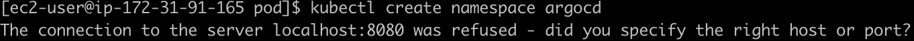

테라폼으로 bastion 환경을 하나 작게 만들었다.    
https://www.44bits.io/ko/post/terraform_introduction_infrastrucute_as_code    

이걸 하고 싶었는데,    
https://devocean.sk.com/blog/techBoardDetail.do?ID=164752&boardType=techBlog    
kubectl 설치를 먼저 해야 했고,

그래도 이건 안된다.    

뭔가 접근이 틀린 것 같아 다시 구글링을 해본다.    
https://medium.com/@sarangrana/getting-started-with-kubernetes-part-1-setting-up-master-node-architecture-with-ubuntu-16-04-11f1e71d1aad    
https://linux.how2shout.com/how-to-install-docker-on-amazon-linux-2023/    

뭔가 삽질중인 것 같아 다시 구글링을 해본다.    
https://devocean.sk.com/blog/techBoardDetail.do?ID=163654    

loadbalancer로 적용을 한 뒤에 kubectl get svc argocd-server -n argocd 로 얻은 external-ip로 접속이 안된다.    
이것은 필시 보안그룹 문제일 것이다.    
누구의 인바운드 룰이 날 막았을지 잠시 생각해본다...     
aws console의 load balancer에 들어가, 걸려 있는 보안그룹에 인바운드 룰을 추가해준다.    
냅다 default를 추가해버렸다... (from anywhere to anywhere)    
그랬더니 접속이 된다. 
다시 default를 지우고, k8s-elb라는 이름이 걸려 있는 곳에 내 IP만 인바운드 룰을 추가한다.    
argocd에 접속이 된다.

