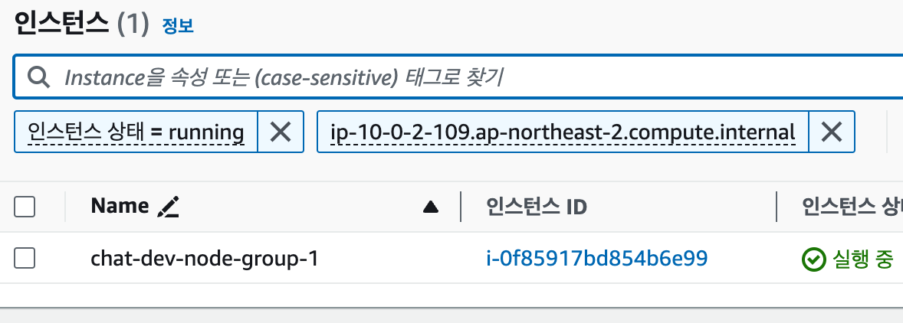

EKS를 최초로 구축하고, 볼륨설정과 도메인설정이라는 필수 기능을 붙이면 다음과 같은 역할들이 생성되어 있다.    
     
    
- 볼륨설정을 위한 IRSA
  - EKS를 시작할 때 테라폼을 통해 생성했다.
- Service Role for EKS, EKS Nodegroup
  - 자동으로 생겼다. 오토스케일링 등을 위해 필요한 infra of infra같은 정책이 붙어있다.
- 노드그룹 (노드 그룹이 두 개면 두 개 역할이 각각 생김)
  - 노드그룹에 권한을 주면 그 노드그룹에 속한 모든 EC2 인스턴스에 적용된다.
  - EKS 작업자 노드는 pod(컨테이너)가 실행되는 곳이다.    
  - 각 작업자 노드는 EC2 인스턴스이며 연결된 IAM 역할이 있다.    
  - pod가 AWS 서비스에 요청할 때마다(예: Parameter Store에서 매개변수 가져오기) 이 요청은 pod가 상주하는 EC2 인스턴스(EKS 작업자 노드)의 IAM 역할에 연결된 IAM 권한을 사용하여 수행된다.    
- addon-iamserviceaccount
  - eksctl 를 통해 생성했다.
  - 원하는 권한과 쿠버네티스 Service Account 이름을 파라미터로 넘기면, 그 권한으로 이루어진 역할을 만들고 그 서비스계정만 접근할 수 있는 IRSA를 싹 설정해준다.

가설 
-
그래서, 노드그룹 한 쪽에만 ssm 관련 롤을 주면, 운좋게 파드가 그 노드그룹에 배치될 때만 정상 작동한다.

2그룹이 가지고 있던 정책은 다음과 같다. Describe만 되고 Get 이 안되는 상황.

반면 1그룹은 다음과 같이 ReadOnly로 가지고 있어 모든 read관련 액션에 접근이 된다.

결과
-
두 노드 모두에서 잘 작동한다.